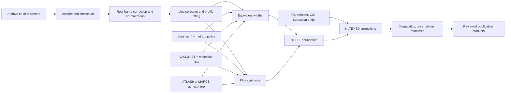

# The Exoplanet Codex science pipeline

Open-science software and curated inputs for deriving stellar elemental
abundances from high-resolution spectra. This is the **science repository**:
it contains analysis code, registries, line data, correction grids, tests, and
provenance records. It is not the separately deployed
[Exoplanet Codex website](https://exoplanetcodex.org), and generated website
products do not belong here.

The project is active research software. Solar and Procyon benchmark paths are
the most developed; 55 Cancri A is the primary science target. Alpha Centauri A/B
have canonical parameters and line-list work. M-dwarf model support exists at
the atmosphere/interface level but does not yet constitute a validated
abundance reproduction. See [reproduction status](docs/reproduction/workflows.md)
before interpreting any output.

## What is reproducible today

| Capability | Status | External inputs |
|---|---|---|
| Configuration, line-list, correction-grid validation | Tested | None |
| Solar O I 777 nm 3D-NLTE correction smoke example | Tested | None; grid is vendored |
| Unit test suite | Tested; asset-dependent tests may skip | iSpec only for integration tests |
| Solar / Procyon normalization and abundance runs | Research workflow | HARPS spectra and full iSpec input bundle |
| 55 Cancri full pipeline | Incomplete | Acquisition has demo data; normalization is not implemented |
| M-dwarf abundance reproduction | Planned/experimental | MARCS.GES plus approved spectrum and line data |

“Tested” does not mean a correction-grid smoke result is a publishable stellar
abundance. Full science products require the stated spectra, atmosphere grids,
radiative-transfer assets, and provenance capture.

## Quick start

Tested on macOS 15 arm64 with Python 3.9.6. Python 3.9–3.11 is the supported
range; other versions are unverified.

```bash
git clone https://github.com/damienabraxas/exoplanetcodex.git
cd exoplanetcodex

python3 -m venv .venv
source .venv/bin/activate
python -m pip install --upgrade pip
python -m pip install -r requirements-lock-py39.txt

python scripts/validate_installation.py
python scripts/quickstart_example.py
cat results/tables/quickstart_oi777.json
python -m pytest -q
```

Python 3.10/3.11 users should install `requirements.txt`; the checked-in lock is
the exact Python 3.9 environment tested for this ticket. The example reads the
canonical solar parameters and the vendored Amarsi et al.
(2019) C/O grid, evaluates the O I 777.194 nm correction, and writes a manifest.
The expected result is approximately `delta=-0.169 dex` and corrected
`A(O)=8.521`; small numerical differences across SciPy versions are acceptable.
It performs no spectral synthesis and needs no model atmosphere.

For iSpec/Turbospectrum work, stage the external bundle, set `ISPEC_DIR`, then
run the stricter preflight:
pip install -r requirements.txt

# List runnable targets (resolve via config/stars.yaml)
python run_pipeline.py --list-stars

# Run the pipeline for the solar calibrator (real spectra; no synthetic data)
python run_pipeline.py --star solar

# Stop after the stellar-parameter stage
python run_pipeline.py --star solar --validate-only

# Run tests
pytest tests/ -v
```

`run_pipeline.py` is a **thin driver**: it orchestrates the real stage `run()`s and
surfaces their own guards. It never generates data and never holds star parameters —
those come only from `config/stars.yaml` via `get_star_params()`. The real sequence is

```
spectra_normalize → lines_fit → [params_stellar*] → abundances_derive
                  → uncertainty_stack → ratios_interpret
```

`*params_stellar` runs **only** for stars that must *solve* a spectroscopic-equilibrium
parameter (Teff/log g/ξ — e.g. 55 Cnc ξ). Pinned calibrators (solar, Procyon, α Cen)
take their parameters straight from `stars.yaml` and skip it. Reading FITS happens inside
`spectra_normalize` (there is no separate acquire step), and linelist loading is internal
to `abundances_derive` (via `data/linelists/loader.py`). Stages that are not yet
implemented stop the run with a clear message rather than fabricating output.

## Pipeline

Scripts use **subject_action** naming: the noun tells you what data it operates on,
the verb tells you what it does. Related scripts sort together alphabetically.

| Script | Operates on | Action | Status |
|--------|-------------|--------|--------|
| `pipeline/spectra_normalize.py` | Raw spectra | Read FITS, co-add, continuum-normalize | **Real** (solar, Procyon) |
| `pipeline/lines_fit.py` | Normalized spectrum | Fit profiles, measure equivalent widths | **Real** (solar path) |
| `pipeline/abundances_derive.py` | EW + params | LTE (+NLTE) EW → A(X) abundance analysis | **Real** |
| `pipeline/params_stellar.py` | EW table | Solve Teff/log g/ξ via excitation+ionization equilibrium | Stub — RYA-537 |
| `pipeline/uncertainty_stack.py` | Abundances | Type A + Type B formal uncertainty budget | Stub |
| `pipeline/ratios_interpret.py` | Abundances | Solar-normalized ratios, Mg/Si, C/O, science plots | Stub |
| `pipeline/spectra_acquire.py` | Raw spectra | ESO/HARPS query + FITS inspection **library** | Not a pipeline stage — `run()` raises |
| `pipeline/lines_load.py` | Line list CSV | VALD3 + NIST loader wrapper | Not a pipeline stage — loading is internal to `abundances_derive` |

`run_pipeline.py` orchestrates only the real stages, in the sequence above. The two
non-stage modules keep their library functions but their `run()` raises (they are not
wired into the driver): `spectra_acquire` used to return synthetic demo data, which is
exactly what this driver removes.

## Repo Structure

```bash
export ISPEC_DIR=/absolute/path/to/ispec
python scripts/validate_installation.py --full \
  --json results/tables/install-validation.json
```

Do not use the old `python run_pipeline.py --star 55cancri` command as a quick
start: the current live code stops at the unimplemented normalization step.

## Pipeline map



The repository stores code and selected redistributable inputs under `data/`.
Large/proprietary spectra and iSpec model assets remain outside Git. Generated
intermediates use `data/processed/`; tables and plots use `results/`. The
website consumes only separately reviewed publication products.

## Canonical inputs

- `config/stars.yaml`: stellar parameters, pin/solve policy, broadening, sources.
- `data/method_policy.yaml`: per-star/species EW-versus-synthesis policy.
- `config/constants.py`: physical constants, paths, element registry, thresholds.
- `data/linelists/`: target line lists and their provenance.
- `data/nlte_grids/`: vendored correction grids and provenance sidecars.
1. Create a free account at the [ESO User Portal](https://www.eso.org/UserPortal)
2. Visit the [ESO Science Archive](http://archive.eso.org/wdb/wdb/adp/phase3_main/form)
3. Search: Target = `HD 75732`, Instrument = `HARPS`, Data Product = `SCIENCE`
4. Download the `ADP.*S1D*.fits` files (merged 1D spectra)
5. Place the files where the star's loader expects them (see `pipeline/spectra_normalize.py`)
6. Run `python run_pipeline.py --star <id>` — `spectra_normalize` reads the FITS directly

(`pipeline/spectra_acquire.py` provides the ESO query / FITS-inspection helpers as a
library, but it is not part of the pipeline run.)

There is currently no `data/catalog/system_catalog.csv`; do not create a second
target registry silently. `config/stars.yaml` is the live stellar registry.

## Documentation

- [Environment and prerequisites](docs/setup/environment.md)
- [Atmosphere, radiative-transfer, NLTE, and 3D assets](docs/models/assets.md)
- [Spectra, atomic data, and directory layout](docs/data/spectra.md)
- [Solar, Procyon, host-star, and M-dwarf workflows](docs/reproduction/workflows.md)
- [Reproducibility and citation](docs/reproducibility.md)
- [Troubleshooting](docs/troubleshooting.md)
- [Line-list construction](docs/linelist_pipeline.md)
- [Scientific limitations from the solar review](docs/pipeline_review_solar.md)

## License and citation

Code is MIT licensed; see [LICENSE](LICENSE). Data and model assets retain their
upstream terms and citation requirements. Record the repository commit and cite
the spectrum archive, atmosphere grid, line database, radiative-transfer code,
and every applied correction grid. A ready-to-fill citation block is in the
[reproducibility guide](docs/reproducibility.md).
