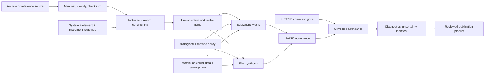

# The Exoplanet Codex science pipeline

Open-science software, scientific registries, and curated inputs for deriving
stellar elemental abundances from high-resolution spectra across the UV, visible,
near-infrared, and infrared. This is the **science repository**, not the
separately deployed [Exoplanet Codex website](https://exoplanetcodex.org).

The project is active research software. Solar and Procyon benchmark paths are
the most developed; Alpha Centauri A/B and 55 Cancri A are current science
targets. Read the [reproduction status](docs/reproduction/workflows.md) before
interpreting any output.

## Canonical scientific registries

> **New here, human or agent? Read [`LEDGERS.md`](LEDGERS.md) first.** It is the
> canonical read-set index: the five ledgers that hold the project's current
> state, what each is source-of-truth for, and its update trigger.

These machine-readable artifacts are the discovery layer for agents,
collaborators, reviewers, and downstream publication systems:

- [System Register](data/catalog/system_catalog.csv) — target identity, role,
  run order, lifecycle, and website key.
- [Instrument and Data-Source Register](data/catalog/instrument_catalog.csv) —
  archive, wavelength capability, resolution, preprocessing, support state, and
  provenance.
- [Element Status Register](data/audit/element_status_tracker.csv) — the current
  canonical element/status artifact while a normalized
  `data/catalog/elements.csv` remains unratified.
- [Stellar parameters](config/stars.yaml) — fundamental parameters and pin/solve
  policy for runnable stars.
- [Method policy](data/method_policy.yaml) — per-star/species EW-versus-synthesis
  selection.

The current target inventory is always the
[System Register](data/catalog/system_catalog.csv); the README does not maintain
a second star list. Instrument capability likewise does not prove that a system
has data. Verified per-system holdings belong in manifests that join
`system_catalog.star_params_key` to `instrument_catalog.instrument_id`. Schemas
and join rules are documented in [data/catalog/README.md](data/catalog/README.md).

## What is reproducible today

| Capability | Status | External inputs |
|---|---|---|
| Registries, line data, correction grids, and core validation | Tested | None |
| Solar O I 777 nm 3D-NLTE correction smoke example | Tested | None; grid is vendored |
| Solar/Procyon normalization and abundance workflows | Research workflow | Approved spectra and full iSpec input bundle |
| Multi-arm solar/Procyon work | Mixed active/experimental | Per-arm holdings, loaders, and conditioning |
| 55 Cancri full pipeline | Incomplete | Normalization route remains unimplemented |
| M-dwarf abundance reproduction | Experimental/planned | MARCS.GES, molecular assets, approved spectrum |

“Tested” does not make a correction-grid smoke result a publishable stellar
abundance. Full products require the stated spectra, model assets, line data,
corrections, diagnostics, and provenance.

## Tested quick start

The exact lock below was tested on macOS 15 arm64 with CPython 3.9.6. Python
3.10/3.11 users should resolve `requirements.txt` and record `pip freeze`.

```bash
git clone https://github.com/damienabraxas/exoplanetcodex.git
cd exoplanetcodex

python3 -m venv .venv
source .venv/bin/activate
python -m pip install --upgrade pip
python -m pip install -r requirements-lock-py39.txt

python scripts/validate_installation.py
python -m data.catalog.instruments
python scripts/quickstart_example.py
cat results/tables/quickstart_oi777.json
python -m pytest -q
```

The example reads canonical solar parameters and the vendored Amarsi et al.
(2019) C/O grid, evaluates the O I 777.194 nm correction, and writes a manifest.
Expected: `delta≈-0.169 dex`, corrected `A(O)≈8.521`. It is an offline
correction-grid smoke test, not spectral synthesis.

For full iSpec/Turbospectrum work:

```bash
export ISPEC_DIR=/absolute/path/to/ispec
python scripts/validate_installation.py --full \
  --json results/tables/install-validation.json
```

The smallest real-spectrum benchmark uses one approved solar or Procyon HARPS
product plus its manifest. A full multi-wavelength reproduction adds only the
arms required for the science question and independently validates each one.

## Multi-wavelength data strategy

HARPS is the optical backbone, not the whole program. HST/STIS and COS provide
FUV/NUV access; UVES and ESPRESSO extend optical/red diagnostics; NIRPS and
SPIRou cover YJH/K; CRIRES+ reaches CO/OH and isotope-sensitive K-band regions;
Kitt Peak, CALSPEC, ACE, and NSO products anchor solar/reference work.

The table below is validated byte-for-byte against selected rows of the
[canonical instrument CSV](data/catalog/instrument_catalog.csv). The full
register also records HARPS-N, HIRES, NIRSPEC, KPF, ESPaDOnS, NARVAL, Phoenix,
CHIRON, iSHELL, MIKE, APOGEE, and explicit candidate/rejected decisions.

<!-- instrument-table:start -->
| Instrument / atlas | Facility · archive | Coverage (nm) | R | Bands | Science role | Key caveats | Codex status |
|---|---|---:|---:|---|---|---|---|
| HST/STIS | STScI · [MAST](https://mast.stsci.edu) | 114–1027 | 500–114000 | FUV/NUV/VIS | Resolved FUV/NUV abundance diagnostics | Grating-specific coverage; scattered-light/chromospheric masks; convert vacuum to air only above 200nm | active |
| HST/COS | STScI · [MAST](https://mast.stsci.edu) | 90–320 | 1500–24000 | FUV/NUV | FUV/NUV coverage and cross-checks | Grating/segment-specific conditioning and chromospheric masks | experimental |
| HARPS | ESO · [ESO Science Archive](https://archive.eso.org) | 378–691 | 115000 | VIS/red_optical | Primary optical abundance backbone | Use reduced merged products; verify BERV and SPECSYS; shared telluric framework routes clean visible lines by line selection and sends affected red-edge windows through molecfit/GDAS | active |
| ESPRESSO | ESO · [ESO Science Archive](https://archive.eso.org) | 378–788 | 70000–140000 | VIS/red_optical | High-stability optical cross-arm reference | Prefer WAVE_AIR where supplied; reject velocity-smeared stack products | active |
| UVES | ESO · [ESO Science Archive](https://archive.eso.org) | 300–1100 | 40000–110000 | FUV_edge/NUV/VIS/red_optical | UV-to-red high-resolution diagnostics | Mode/dichroic specific coverage; apply BERV only when product frame requires it | active |
| FEROS | ESO · [ESO Science Archive](https://archive.eso.org) | 350–920 | 48000 | NUV/VIS/red_optical | Supplementary wide optical coverage | Confirm object identity and product frame before use | experimental |
| CRIRES+ | ESO · [ESO Science Archive](https://archive.eso.org) | 950–5300 | 50000–100000 | Y/J/H/K/L/M | K-band CO/OH and isotopic synthesis | WAVE is NANOMETRES (TUNIT1=nm) - convert to A; SPECSYS=TOPOCENT and ESO TEL TARG RADVEL is a 0.0 placeholder, so Vesta needs the two-leg reflected-solar conditioning (RYA-372), not a stellar BERV; select on the WAVE array with QUAL==0, never on WAVELMIN/MAX (settings are combs with real gaps); NOT continuum-normalised (adu); co-add epochs only within a rotation-safe phase; molecfit conditioning owed | experimental |
| NIRPS | ESO · [ESO Science Archive](https://archive.eso.org) | 972.4–1919.6 | 70000–85000 | Y/J/H | YJH molecular and atomic diagnostics | Prefer WAVE_AIR where supplied; do not reapply BERV; custom DRS may be required | experimental |
| SPIRou | CFHT · [CADC](https://www.cadc-ccda.hia-iha.nrc-cnrc.gc.ca) | 955.8–2515.8 | 70000 | Y/J/H/K | NIR atomic and molecular coverage | Only APERO telluric-corrected _t.fits; vacuum-nm to air-A; compute BERV | experimental |
| GHOST | Gemini · [Gemini Observatory Archive](https://archive.gemini.edu) | 363–950 | 56000–76000 | NUV/VIS/red_optical | Southern high-resolution optical gap filler | Confirm mode and DRAGONS product schema | candidate |
| Kitt Peak Solar Flux Atlas | NSO · [NSO Digital Library](https://nispdata.nso.edu/ftp/pub/atlas/) | 296–1300 | 300000–500000 | NUV/VIS/red_optical/NIR | Primary resolved solar reference | Use measured disk-integrated flux atlas; preserve original sampling | reference |
| CALSPEC solar composite | STScI · [MAST CALSPEC](https://archive.stsci.edu/hlsps/reference-atlases/cdbs/calspec/) | 119.5–2695.7 | 150–300 | FUV/NUV/VIS/NIR/IR | Absolute flux and deep-UV coverage | Cited composite only; never label as direct solar measurement | reference |
<!-- instrument-table:end -->

See [instrument strategy and preprocessing](docs/data/instruments.md) for archive
coverage, air/vacuum handling, tellurics, iodine rejection, product formats, and
minimal versus full reproduction.

## Pipeline



`run_pipeline.py` is a thin driver over real stage `run()` functions. It does
not generate synthetic replacement data or own stellar parameters. Current
stages stop loudly when a target/path is unsupported.

| Stage | Current role/status |
|---|---|
| `pipeline/spectra_normalize.py` | Real FITS/co-add/normalization paths for supported targets |
| `pipeline/lines_fit.py` | Real line-profile/EW path where wired |
| `pipeline/abundances_derive.py` | LTE/NLTE abundance and synthesis engines |
| `pipeline/params_stellar.py` | Spectroscopic solve path; incomplete for some targets |
| `pipeline/uncertainty_stack.py` | Partial/stub |
| `pipeline/ratios_interpret.py` | Partial/stub |

Do not use `python run_pipeline.py --star 55cancri` as a quick start; its
normalization route is not implemented.

## Documentation

- [Environment and prerequisites](docs/setup/environment.md)
- [Atmospheres, radiative transfer, NLTE, and 3D assets](docs/models/assets.md)
- [Instrument and archive strategy](docs/data/instruments.md)
- [Spectral/atomic data and directory layout](docs/data/spectra.md)
- [Solar, Procyon, host-star, and M-dwarf workflows](docs/reproduction/workflows.md)
- [Reproducibility and provenance](docs/reproducibility.md)
- [Categorized scientific references](docs/references.md)
- [Troubleshooting](docs/troubleshooting.md)

## License and citation

Code is MIT licensed; data/model assets retain upstream terms. Cite the code
commit, spectrum archive and instrument paper, atmosphere/radiative-transfer
software, atomic/molecular datasets, solar reference, and every correction grid
actually used. Start with the [citation guide](docs/reproducibility.md) and
[categorized bibliography](docs/references.md).
